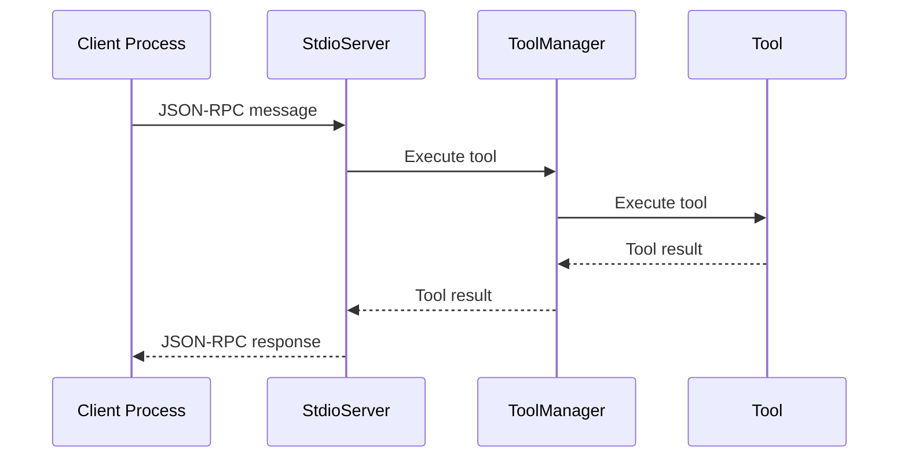
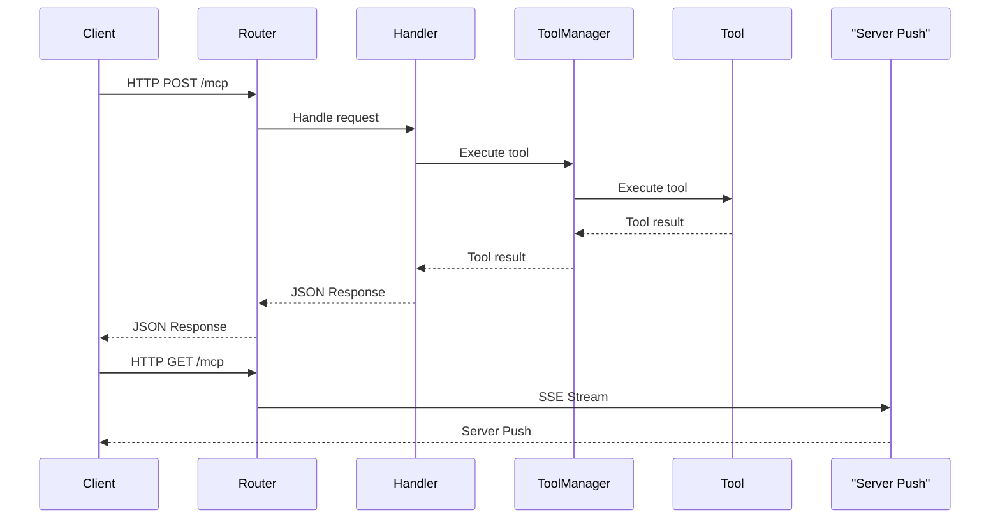

# Development Guide

This document contains the development roadmap, architecture details, and technical implementation notes for the Godot MCP Go server.

## Development Roadmap

### ✅ Completed Features

#### 1. Project Setup

- [x] Create project directory structure
- [x] Initialize Go module with echo framework
- [x] Create basic project files and documentation

#### 2. Core Architecture

- [x] Implement MCP server initialization
- [x] Implement dual transport layer (stdio and Streamable HTTP)
- [x] Implement message handling with JSON-RPC
- [x] Implement error handling and logging system
- [x] Implement session management for Streamable HTTP

#### 3. Transport Layer

- [x] **stdio transport**: Direct process communication
- [x] **Streamable HTTP transport**: HTTP-based with SSE streaming
- [x] **Session management**: Unique session IDs and cleanup
- [x] **CORS support**: Proper headers for web-based clients

#### 4. Tool System

- [x] **Interface-based design**: `types.Tool` interface for all tools
- [x] **Organized categories**: Node, Script, Scene, Project, Utility tools
- [x] **JSON-RPC integration**: Direct JSON handling with flexible request IDs
- [x] **Thread-safe management**: Concurrent tool execution support
- [x] **Backward compatibility**: Legacy tool function support

#### 5. Configuration System

- [x] JSON-based configuration
- [x] Environment variable overrides
- [x] Configuration validation
- [x] Default configuration generation

### 🔄 In Progress

#### 6. Testing

- [x] Unit tests for core components
- [x] Transport layer tests
- [x] Tool system tests
- [x] Integration tests
- [ ] Performance testing
- [ ] Concurrent connection testing

### 📋 Planned Features

#### 7. Godot Integration

- [ ] Implement actual Godot API integration
- [ ] Real-time scene tree updates
- [ ] Script execution and modification
- [ ] Project state synchronization
- [ ] Editor state management

#### 8. Advanced Features

- [ ] Tool parameter validation with JSON Schema
- [ ] Tool execution progress reporting
- [ ] Tool execution logging and monitoring
- [ ] Tool permission control
- [ ] Tool result caching
- [ ] Performance optimization

#### 9. Documentation and Deployment

- [ ] API documentation
- [ ] Usage examples and tutorials
- [ ] Build scripts and distribution packages
- [ ] Installation and upgrade instructions
- [ ] Changelog and release notes

#### 10. Skills Support

- [ ] Skill manifest discovery and registration
- [ ] Skill-to-tool mapping and routing
- [ ] Skill-scoped prompt templates
- [ ] Skill loading configuration (local/remote)
- [ ] Skills compatibility tests (Inspector + HTTP smoke)

## Architecture Details

### Transport Layer Architecture

#### stdio Transport

```go
// transport/stdio/server.go
type StdioServer struct {
    toolManager *tools.Manager
}

func (s *StdioServer) Start() error {
    // JSON-RPC message handling via stdin/stdout
    // Direct process communication
}
```

#### Streamable HTTP Transport

```go
// transport/http/server.go
type Server struct {
    registry       *mcp.Registry
    toolManager    *tools.Manager
    sessionManager *SessionManager
    config         *config.Config
    echo           *echo.Echo
}

// transport/http/streamable.go
type StreamableHTTPTransport struct {
    writer  http.ResponseWriter
    flusher http.Flusher
    mu      sync.Mutex
    closed  bool
}
```

### Tool System Architecture

#### Tool Interface

```go
// tools/types/common.go
type Tool interface {
    Name() string
    Description() string
    InputSchema() mcp.InputSchema
    Execute(args json.RawMessage) ([]byte, error)
}

type ToolRegistry interface {
    RegisterTool(tool Tool) error
    GetTool(name string) (Tool, bool)
    ListTools() []Tool
    ExecuteTool(name string, args json.RawMessage) ([]byte, error)
}
```

#### Tool Categories

- **Node Tools** (`tools/node/`): Scene tree manipulation
- **Script Tools** (`tools/script/`): Script management
- **Scene Tools** (`tools/scene/`): Scene operations
- **Project Tools** (`tools/project/`): Project management
- **Utility Tools** (`tools/utility/`): General utilities

#### Skills Integration (Planned)

- Expose skill metadata through MCP prompt endpoints (`prompts/list`, `prompts/get`)
- Allow a skill to bind one or more tool invocations with validated input
- Keep skill loading optional so server startup remains stable without external skill packs

### Message Flow

#### stdio Flow



#### Streamable HTTP Flow



## Technical Implementation Notes

### JSON-RPC Integration

The server uses JSON-RPC 2.0 for all message communication:

```go
// mcp/jsonrpc/messages.go
type Request struct {
    JSONRPC string          `json:"jsonrpc"`
    ID      any             `json:"id,omitempty"`
    Method  string          `json:"method"`
    Params  json.RawMessage `json:"params,omitempty"`
}
```

Skill-oriented requests will use the same JSON-RPC envelope and rely on prompt/tool methods for discovery and invocation.

### Session Management

Streamable HTTP uses session-based communication:

```go
// transport/http/session.go
type SessionManager struct {
    sessions map[string]*Session
    mu       sync.RWMutex
}

type Session struct {
    ID          string
    Created     time.Time
    LastSeen    time.Time
    Initialized bool
    Transport   *StreamableHTTPTransport
}
```

### Error Handling

Comprehensive error handling with structured logging:

```go
// logger/logger.go
func Error(msg string, args ...any) {
    logger.Error(msg, args...)
}
```

### Configuration Management

Flexible configuration with environment variable overrides:

```go
// config/config.go
type Config struct {
    Name        string      `json:"name"`
    Version     string      `json:"version"`
    Description string      `json:"description"`
    Server      Server      `json:"server"`
    Transports  []Transport `json:"transports"`
    Logging     Logging     `json:"logging"`
}
```

## Migration History

### Transport Migration (SSE → Streamable HTTP)

**Changes Made:**

1. **Removed**: Deprecated SSE transport (`transport/sse.go`)
2. **Added**: Streamable HTTP transport with session management
3. **Updated**: All endpoints from `/events` to `/mcp`
4. **Enhanced**: CORS headers and security validation
5. **Improved**: Error handling and connection management

**Benefits:**

- Standard compliance with latest MCP specification
- Better session management with unique IDs
- Improved security with proper CORS validation
- Enhanced reliability and connection management
- Future-proof architecture

### Tool System Refactoring

**Changes Made:**

1. **Interface-based design**: All tools implement `types.Tool`
2. **Organized structure**: Tools grouped by category
3. **JSON optimization**: Direct `json.RawMessage` handling
4. **Thread safety**: Concurrent execution support
5. **Backward compatibility**: Legacy function support

**Benefits:**

- Unified tool management
- Better performance with optimized JSON handling
- Improved maintainability and extensibility
- Thread-safe concurrent execution
- Easy testing and mocking

## Development Guidelines

### Code Style

- Follow Go conventions and best practices
- Use meaningful variable and function names
- Add comprehensive comments for complex logic
- Implement proper error handling

### Testing

- Write unit tests for all new features
- Maintain high test coverage
- Test both stdio and HTTP transports
- Test concurrent scenarios

### Documentation

- Update README.md for user-facing changes
- Update DEVELOPMENT.md for technical changes
- Add inline comments for complex logic
- Document API changes and breaking changes

### Performance

- Use efficient JSON handling with `json.RawMessage`
- Implement proper connection pooling
- Monitor memory usage and cleanup
- Profile critical paths

## Future Considerations

### Scalability

- Consider microservice architecture for large deployments
- Implement load balancing for multiple server instances
- Add caching layer for frequently accessed data
- Consider database integration for persistent state

### Security

- Implement authentication and authorization
- Add rate limiting for API endpoints
- Implement request validation and sanitization
- Add audit logging for security events

### Monitoring

- Add metrics collection and monitoring
- Implement health checks and status endpoints
- Add performance profiling and optimization
- Implement alerting for critical issues
